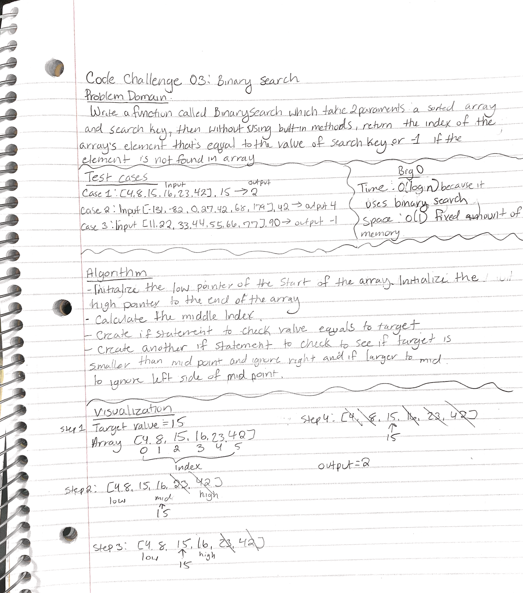

# Code Challenge 03: Array-binary-search.

Write a function called `BinarySearch` which takes in 2 parameters: a sorted array and the search key. Without utilizing any of the built-in methods available to your language, return the index of the array’s element that is equal to the value of the search key, or -1 if the element is not in the array.

## Whiteboard Process

## Pseudo Code

function BinarySearch(int[] arr, int, target)

    int lowpt = 0
    int highpt = arr.length - 1 //initialize low and high point

    while lowpt <= highpt:

    int midpt = highpt + lowpt / 2   //calculate midpoint
    if arr[midpt] == target:
            return midpt
        else
        if arr[midpt] < target:
            lowpt = midpt + 1
        else:
            highpt = midpt - 1

    return -1

## Approach & Efficiency

The provided Wiki article in binary searches and the diagram, helped break down the problem abit. In this approach, we would follow the standard step of dividing the ranges until the targetted value is found. I did have abit trouble understanding time/space of Big-O for this. But from what I found, the time complexity would be O(log n) because it uses binary search. And thr space complexity about be 0(1) because space is fixed.

## Solution

NOTE: This challenge is whiteboard only

Write out code as part of your whiteboard process, but don’t worry about creating external program files.
