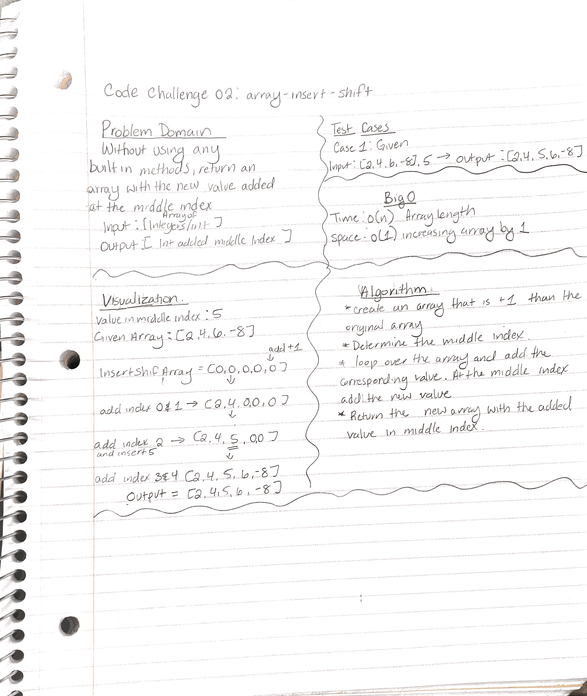
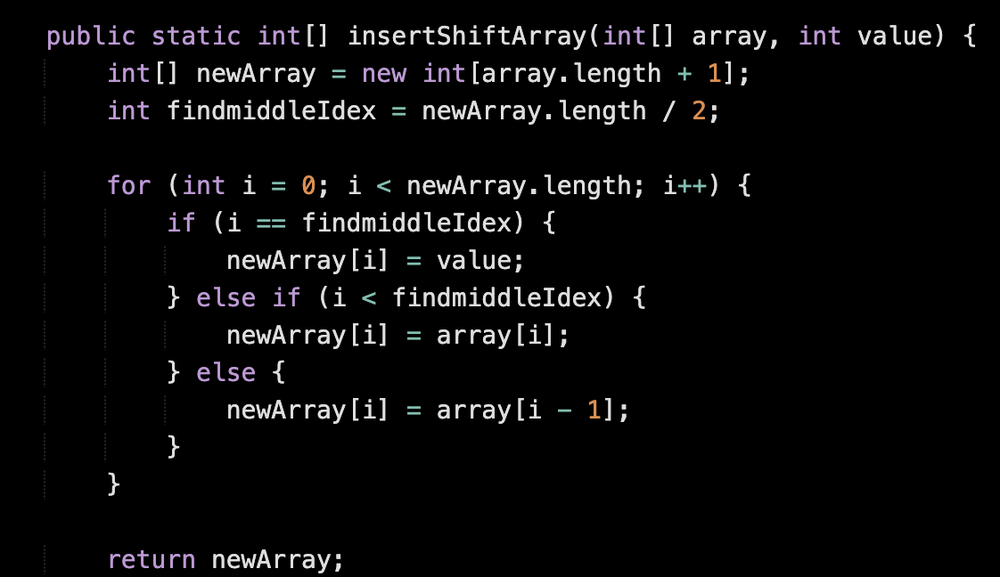
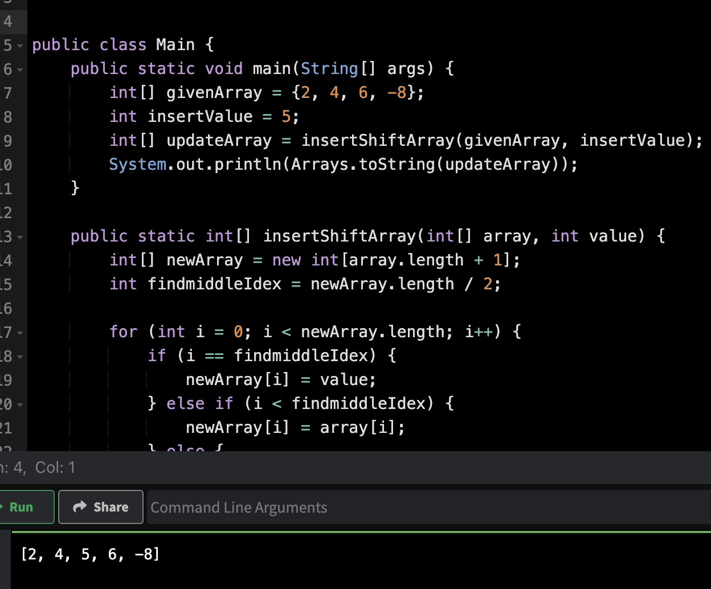

# Code Challenge 2: array-insert-shift

Without using any built-in methods, return an array with the new value added at the middle index.

## Whiteboard Process

## Approach & Efficiency

The visualization and writing out the algorithm helped with the process.

## Solution

# Resources

* chatgbt https://chat.openai.com/
