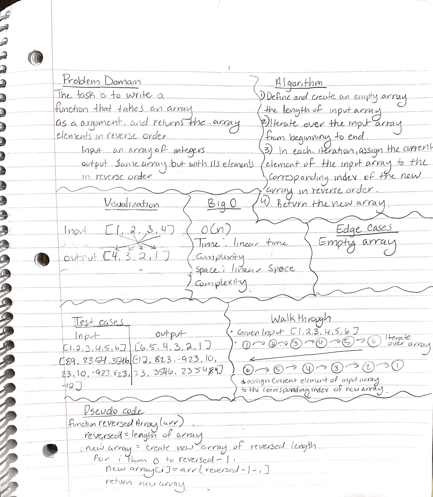

# Code Challenge 1: Array-Reverse

The task is to write a function that takes an array as an argument and returns the array with its elements in reverse order.

## Whiteboard Process

## Approach & Efficiency

My initial thought process was to solve this problem using methods, similar to how I would approach it in JavaScript. However, I needed assistance from ChatGPT to understand how to implement the same solution in Java. By doing this, it was helpful for me to understand how java worked compared to javascript.

In terms for space and time complexity if I'm understanding the question. The time complexity of the approach is O(n) because we are iterating through input array over once. The space complexity is O(n) because we create a new array of the same size as the input array, which will have the reversed elements of the input array.

## Solution

NOTE: This challenge is whiteboard only
Write out code as part of your whiteboard process, but don’t worry about creating external program files.
